# Individual Panels — Generated from Raw Data

All figures rendered directly from source data (no cropping). Organized by paper section.

---

## §3 · Geometry Characterization (Paper 1 / Table 1)

These back the claim that conversation-state trajectories are low-rank, curvature predicts decoder drift, and boundary detection is meaningful.

### Rank-95 by Conversation Family
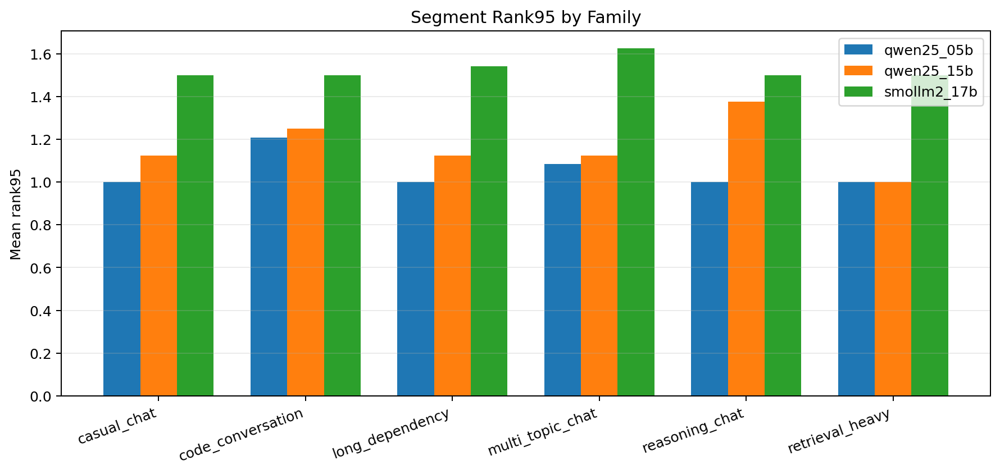
**[rank95_by_family.png](rank95_by_family/rank95_by_family.png)**
Mean rank-95 per family per model — shows near-minimal dimensionality.

### Rank-Energy Curves
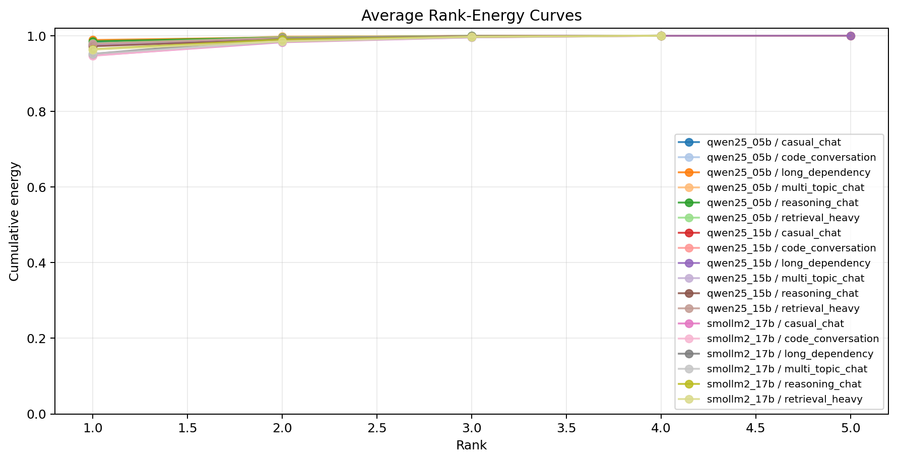
**[rank_energy_curves.png](rank_energy_curves/rank_energy_curves.png)**
Average cumulative energy vs singular-value rank per model/family combo.

### Geometry–Decoder Coupling (Scatter)
| Geodesic vs Logit L2 | Geodesic vs KL |
|---|---|
| [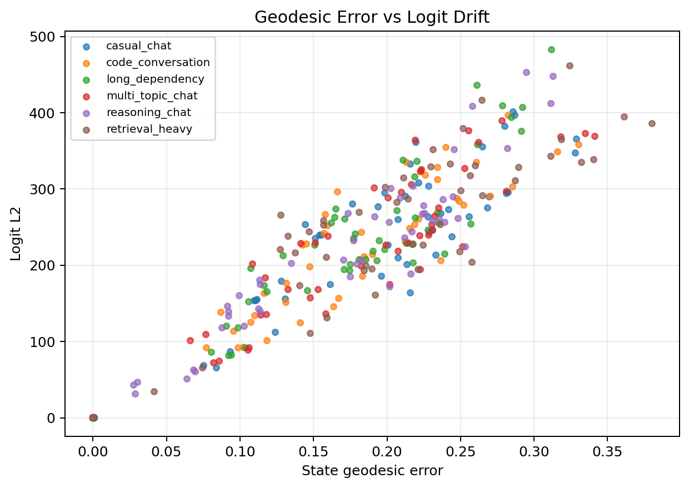](geometry_vs_decoder/geodesic_vs_logitL2.png) | [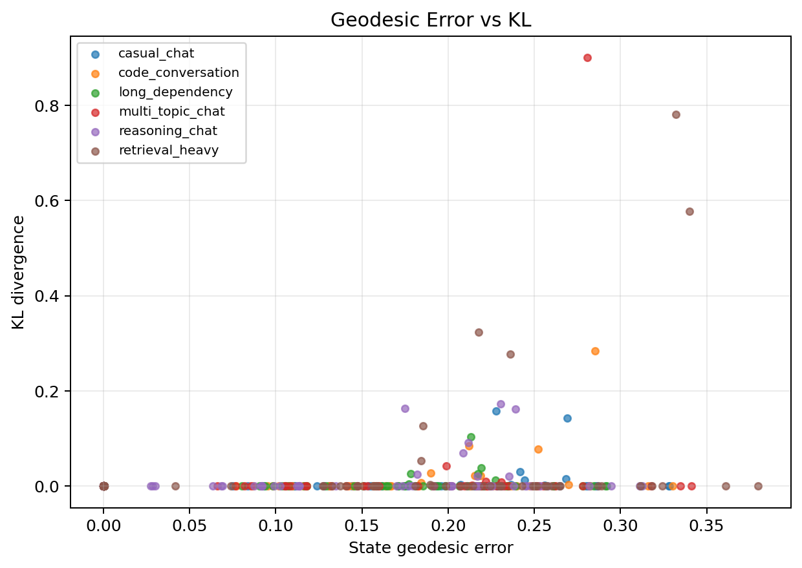](geometry_vs_decoder/geodesic_vs_KL.png) |
| [geodesic_vs_logitL2.png](geometry_vs_decoder/geodesic_vs_logitL2.png) | [geodesic_vs_KL.png](geometry_vs_decoder/geodesic_vs_KL.png) |

Per-turn geodesic error vs decoder output drift — backs the *r* ≥ 0.989 coupling claim.

### Family Correlation Heatmap
| corr(geodesic, logit L2) | corr(geodesic, KL) |
|---|---|
| [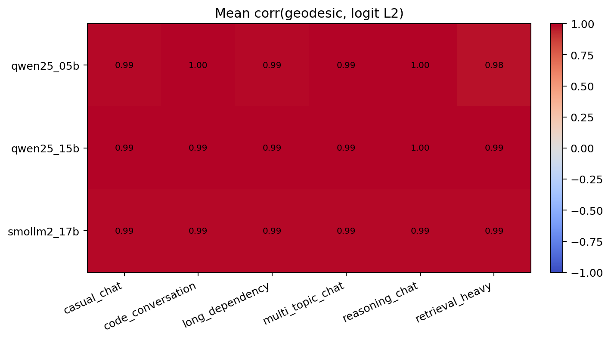](family_correlation_heatmap/corr_geodesic_logitL2.png) | [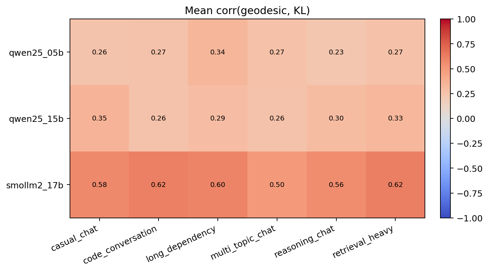](family_correlation_heatmap/corr_geodesic_KL.png) |
| [corr_geodesic_logitL2.png](family_correlation_heatmap/corr_geodesic_logitL2.png) | [corr_geodesic_KL.png](family_correlation_heatmap/corr_geodesic_KL.png) |

### Boundary Detection — Geometry vs Baselines
**Geometry boundary F1:**
| Exact | Tol-1 | Tol-2 | Tol-3 |
|---|---|---|---|
| [boundary_f1_exact.png](boundary_eval_heatmap/boundary_f1_exact.png) | [boundary_f1_tol1.png](boundary_eval_heatmap/boundary_f1_tol1.png) | [boundary_f1_tol2.png](boundary_eval_heatmap/boundary_f1_tol2.png) | [boundary_f1_tol3.png](boundary_eval_heatmap/boundary_f1_tol3.png) |

**Baseline boundary F1:**
| Exact | Tol-1 | Tol-2 | Tol-3 |
|---|---|---|---|
| [baseline_f1_exact.png](baseline_eval_heatmap/baseline_f1_exact.png) | [baseline_f1_tol1.png](baseline_eval_heatmap/baseline_f1_tol1.png) | [baseline_f1_tol2.png](baseline_eval_heatmap/baseline_f1_tol2.png) | [baseline_f1_tol3.png](baseline_eval_heatmap/baseline_f1_tol3.png) |

### Per-Family Traces

**Curvature traces** (high curvature → local trajectory deflection = constraint turn signal):
| casual_chat | code_conversation | long_dependency |
|---|---|---|
| [casual_chat.png](curvature_traces/casual_chat.png) | [code_conversation.png](curvature_traces/code_conversation.png) | [long_dependency.png](curvature_traces/long_dependency.png) |

| multi_topic_chat | reasoning_chat | retrieval_heavy |
|---|---|---|
| [multi_topic_chat.png](curvature_traces/multi_topic_chat.png) | [reasoning_chat.png](curvature_traces/reasoning_chat.png) | [retrieval_heavy.png](curvature_traces/retrieval_heavy.png) |

**Hybrid boundary score traces:**
| casual_chat | code_conversation | long_dependency |
|---|---|---|
| [casual_chat.png](boundary_score_traces/casual_chat.png) | [code_conversation.png](boundary_score_traces/code_conversation.png) | [long_dependency.png](boundary_score_traces/long_dependency.png) |

| multi_topic_chat | reasoning_chat | retrieval_heavy |
|---|---|---|
| [multi_topic_chat.png](boundary_score_traces/multi_topic_chat.png) | [reasoning_chat.png](boundary_score_traces/reasoning_chat.png) | [retrieval_heavy.png](boundary_score_traces/retrieval_heavy.png) |

**Boundary prominence traces:**
| casual_chat | code_conversation | long_dependency |
|---|---|---|
| [casual_chat.png](boundary_prominence_traces/casual_chat.png) | [code_conversation.png](boundary_prominence_traces/code_conversation.png) | [long_dependency.png](boundary_prominence_traces/long_dependency.png) |

| multi_topic_chat | reasoning_chat | retrieval_heavy |
|---|---|---|
| [multi_topic_chat.png](boundary_prominence_traces/multi_topic_chat.png) | [reasoning_chat.png](boundary_prominence_traces/reasoning_chat.png) | [retrieval_heavy.png](boundary_prominence_traces/retrieval_heavy.png) |

---

## §3.2 · Geometry-Aware Budget Allocation (Paper 2)

Backs the claim that geometry-guided retention beats uniform on the hard stress set.

### Logit Budget Curves (geometry beats uniform, 3 models)
| qwen25_05b | qwen25_15b | smollm2_17b |
|---|---|---|
| [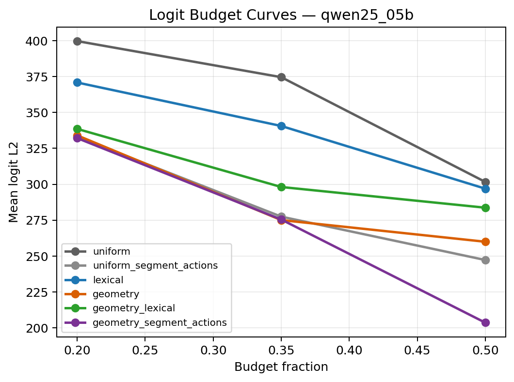](logit_budget_curves/qwen25_05b.png) | [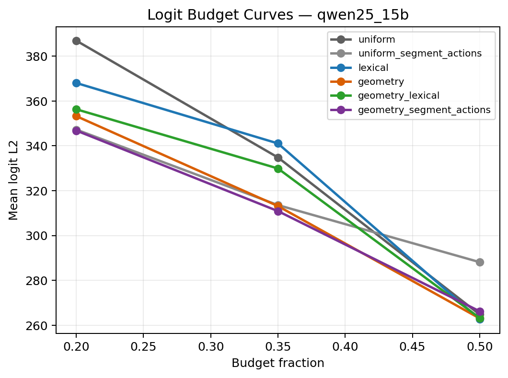](logit_budget_curves/qwen25_15b.png) | [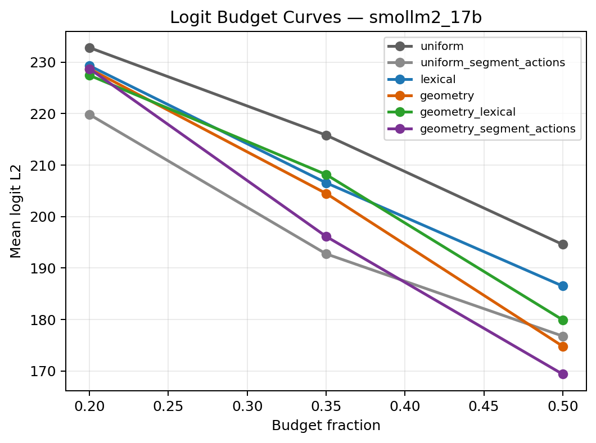](logit_budget_curves/smollm2_17b.png) |
| [qwen25_05b.png](logit_budget_curves/qwen25_05b.png) | [qwen25_15b.png](logit_budget_curves/qwen25_15b.png) | [smollm2_17b.png](logit_budget_curves/smollm2_17b.png) |

### KL Budget Curves
| qwen25_05b | qwen25_15b | smollm2_17b |
|---|---|---|
| [qwen25_05b.png](kl_budget_curves/qwen25_05b.png) | [qwen25_15b.png](kl_budget_curves/qwen25_15b.png) | [smollm2_17b.png](kl_budget_curves/smollm2_17b.png) |

### Token Budget Curves (realized vs nominal budget)
| qwen25_05b | qwen25_15b | smollm2_17b |
|---|---|---|
| [qwen25_05b.png](token_budget_curves/qwen25_05b.png) | [qwen25_15b.png](token_budget_curves/qwen25_15b.png) | [smollm2_17b.png](token_budget_curves/smollm2_17b.png) |

### Family × Policy Logit Heatmap
[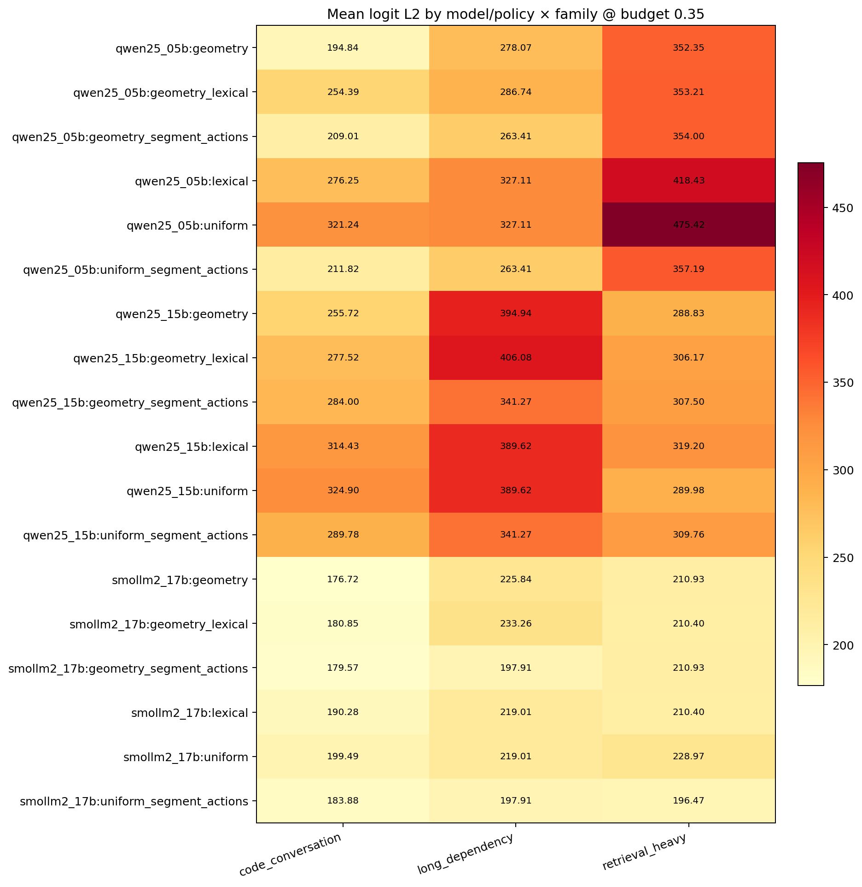](family_logit_heatmap/family_logit_heatmap.png)
**[family_logit_heatmap.png](family_logit_heatmap/family_logit_heatmap.png)**
Mean logit L2 per (model, policy) × conversation family at budget 0.35.

### Support-Turn Rescue Mechanism (Paper 2 checkpoint)
[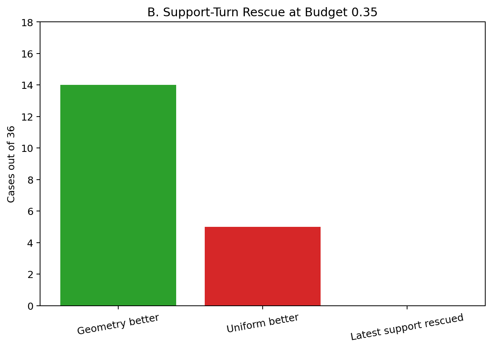](paper2_checkpoint/B_support_turn_rescue.png)
**[B_support_turn_rescue.png](paper2_checkpoint/B_support_turn_rescue.png)**
Geometry retains more constraint-critical support turns than uniform in 14–17/36 cases (Table rescue in paper).

### Cross-Model Geometry vs Uniform at Budget 0.35
[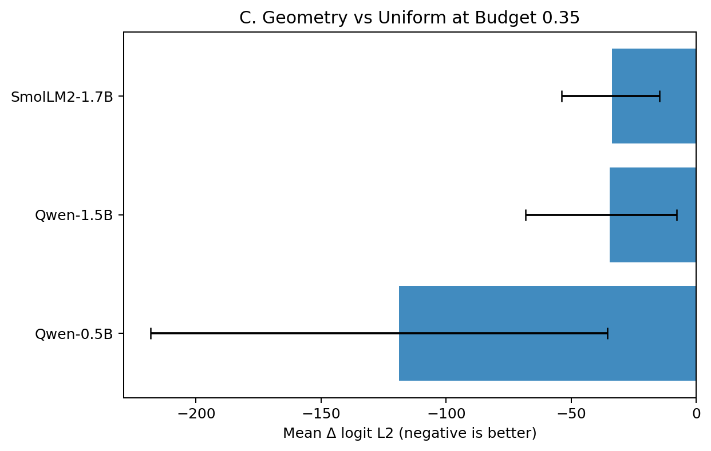](paper2_checkpoint/C_geometry_vs_uniform.png)
**[C_geometry_vs_uniform.png](paper2_checkpoint/C_geometry_vs_uniform.png)**
Mean Δ logit L2 with bootstrap CI across all 3 models — all negative (geometry wins).

---

## §3.3–3.5 · KCD Codec Experiments (Paper 3 / Experiments 1, 4)

### Experiment 1 & 4: qwen25_15b Fairness Sweep (Δ logit vs uniform)
[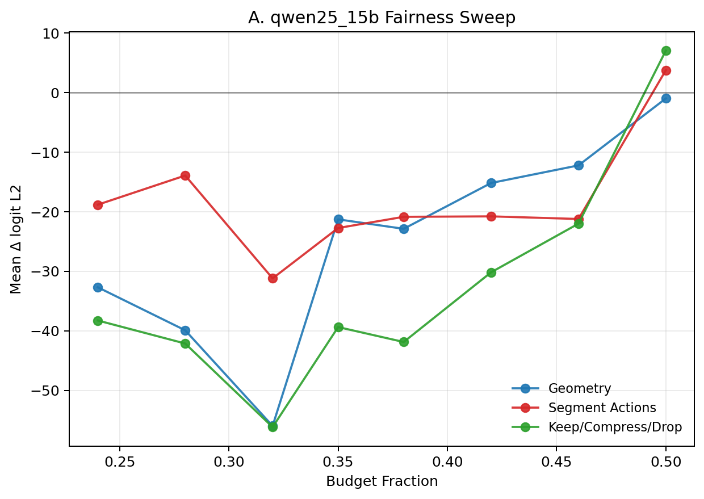](paper3_checkpoint/A_15b_fairness_sweep.png)
**[A_15b_fairness_sweep.png](paper3_checkpoint/A_15b_fairness_sweep.png)**
Δ logit L2 relative to uniform across 8 budgets for geometry, segment_actions, keep/compress/drop (qwen25_15b). Backs Exp 1 and the fairness sweep claim.

### Experiment 4: qwen25_3b Probe (3B model scale validation)
[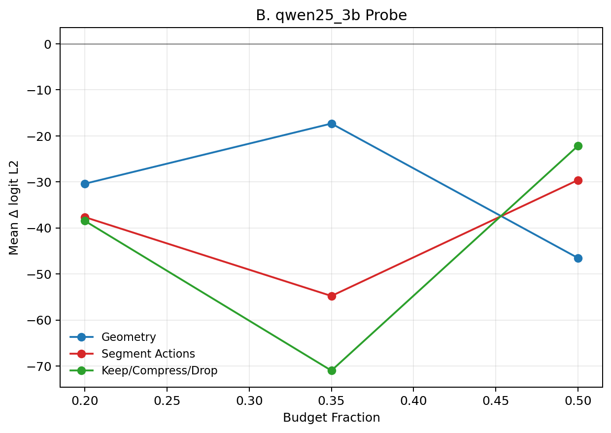](paper3_checkpoint/B_3b_probe.png)
**[B_3b_probe.png](paper3_checkpoint/B_3b_probe.png)**
Same comparison at 3 budgets for qwen25_3b. Geometry advantage grows with model scale (§3.5).

### Active Compression in Keep/Compress/Drop
[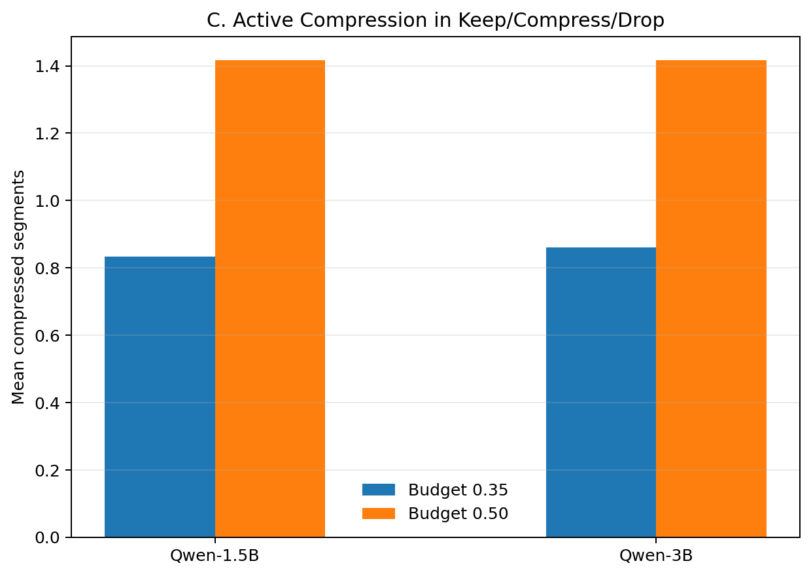](paper3_checkpoint/C_active_compression.png)
**[C_active_compression.png](paper3_checkpoint/C_active_compression.png)**
Mean number of segments actively compressed at budgets 0.35 and 0.50 — confirms codec is using compression, not just keeping/dropping.

### Memory-Critical Mechanism at Budget 0.35
[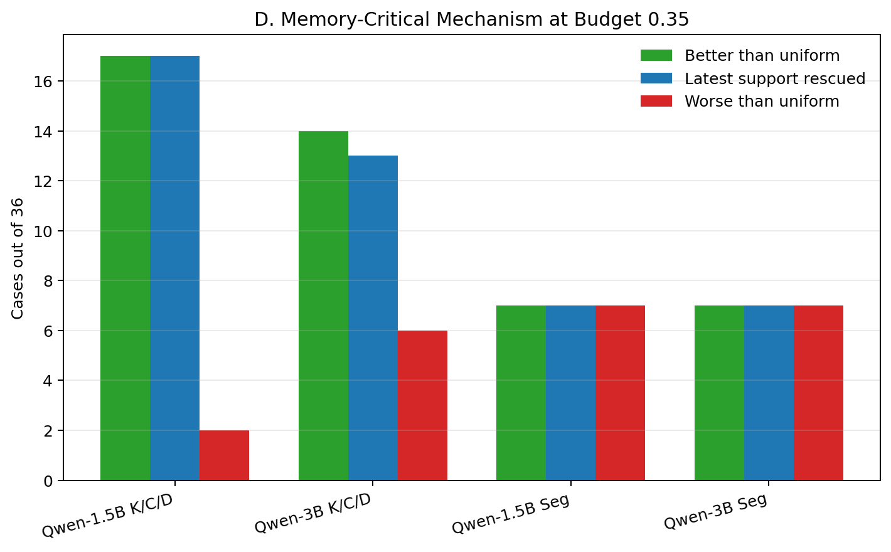](paper3_checkpoint/D_memory_critical_mechanism.png)
**[D_memory_critical_mechanism.png](paper3_checkpoint/D_memory_critical_mechanism.png)**
Support-turn rescue counts across 4 codec/model combinations — backs Table rescue numbers in Exp 1 and 4.

---

## Data sources

| Figure group | Raw data |
|---|---|
| All curvature/boundary/rank/geometry traces | `results/paper1/studies/expanded_v8_final/*/` (per-conversation JSON) |
| Heatmaps, rank95, correlation | `artifacts/paper1/expanded_v8_final/conversation_summary.csv` |
| Baseline heatmap | `artifacts/paper1/expanded_v8_final/baseline_conversation_summary.csv` |
| Budget curves (logit/kl/token) | `artifacts/paper2/behavior_stress_v1/policy_budget_summary.csv` |
| Family logit heatmap | `results/paper2/studies/behavior_stress_v1/{model}/evaluation_rows.csv` |
| Paper 2 checkpoint panels B, C | `artifacts/paper2/blazing_study_v3_confidence/significance_summary.json` + `memory_critical_qwen25_05b_b035.md` |
| Paper 3 checkpoint panels A–D | `artifacts/paper3/paper3_batch_v1_fairness/` + `paper3_batch_v1_3b/` |

To regenerate all panels: `python scripts/generate_individual_panels.py`
